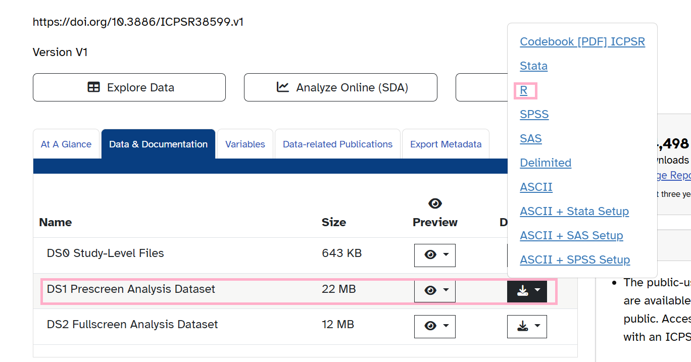

# Causal Inference: Causal Impact of Moral Agency on Recidivism in Juvenile Delinquency
###### Author: Avianna Bui
###### Project Area: Psychology, Sociology, Criminal Justice
###### Statistical Methods: Full Matching, Doubly Robust Estimation, Moderation Analysis & Sensitivity Analysis

### Research Questions
I examine two research questions in this project: 
  1. Explore the causal impact of moral agency on criminal behavior, specifically within the context of recidivism among juvenile delinquents. I define moral agency as the capability of moral decision-making and the willingness to be accountable for one’s behavior under a normative ethical framework. 
  2. Investigate how internal moral frameworks intersect with social and systemic factors in influencing criminal behavior. To achieve this goal, I conduct a moderation analysis to examine the link between moral agency and recidivism under different social conditions, informed by two sociological theories of crime. 

### Structure of the Repository

The Github Repository includes my Final Project Paper, which includes detailed descriptions of my research questions & motivations, data context & transformation process, research methods, results, as well as a discussion of the project's limitations and future directions. The repository also contains my code files in both an R Markdown and readable Github document format along with the dataset I use in my analysis. 

### Instructions to Download the Dataset

My dataset is collected from the Florida Department of Juvenile Justice’s (FDJJ) Information System, which includes 7,117 juvenile probationers in Florida who have completed community supervision between July 2015 and June 2018. The data, in addition to a detailed review of its context and the codebook, can be accessed at [this link](https://www.icpsr.umich.edu/web/ICPSR/studies/38599/datadocumentation). To download the dataset, select the Download button next to “DS1 Prescreen Analysis Dataset” as indicated in the image below, and click on the link for R to download the dataset in .rdata format.



### Packages to install in R

The following code chunk includes the required R packages needed to run our analyses. To install these packages, copy the following code chunk and run it in your RStudio console

```r
install.packages("dplyr")
install.packages("ggplot2")
install.packages("tidyverse")
install.packages("dagitty")
install.packages("scales")
install.packages("ggdag")
install.packages("MatchIt")
install.packages("WeightIt")
install.packages("cobalt")
install.packages("marginaleffects")
install.packages("ltm")
install.packages("AIPW")
install.packages("SuperLearner")
install.packages("EValue")
```
