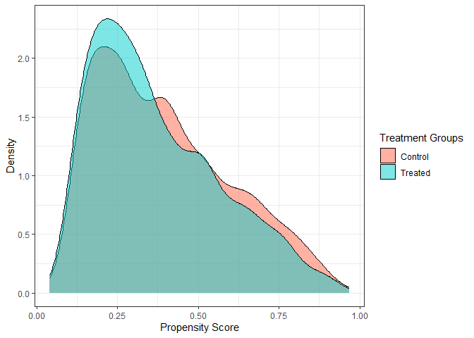

Causal Impact of Moral Agency on Recidivism in Juvenile Delinquency
================
Avianna Bui

## Research Questions

I examine two research questions in this project:

1.  Explore the causal impact of moral agency on criminal behavior,
    specifically within the context of recidivism among juvenile
    delinquents. I define moral agency as the capability of moral
    decision-making and the willingness to be accountable for one’s
    behavior under a normative ethical framework.
2.  Investigate how internal moral frameworks intersect with social and
    systemic factors in influencing criminal behavior. To achieve this
    goal, I conduct a moderation analysis to examine the link between
    moral agency and recidivism under different social conditions,
    informed by two sociological theories of crime

## Data Context & Transformation

### Data Context

My dataset is collected from the Florida Department of Juvenile
Justice’s (FDJJ) Information System, which includes 7,117 juvenile
probationers in Florida who have completed community supervision between
July 2015 and June 2018. The FDJJ has a community-based placement
program for youth with diversion and day treatment programs, probation
supervision, and family therapy to aid the youth’s transition to the
community. The data comprises FDJJ’s demographical and criminal record
data for each adolescent probationer as well as their C-PACT pre-screen
evaluation results, which include information on their behavior at
school and family settings, attitudes toward aggression and law, etc.
The C-PACT is a semi-structured interview conducted by trained staff
with corroboration by the adolescents’ families, teachers, etc. whenever
possible.

``` r
pre_screen_data <- get(load("prescreen-data.rda"))
```

### Data Transformation

After transforming the original data and filter out all cases with
perfect moral agency score in both the 1st & 4th assessment, there are
**5736** cases remain in my data, which is a relatively good sample
size.

``` r
df <- pre_screen_data %>% 
  filter(PACTNUMBER %in% c("(4) FOURTH PACT'", "(1) FIRST PACT")) %>%
  mutate(LAWABIDING = case_when(LAWABIDING == "(1) Abides by conventions-values" ~ 5,
                                LAWABIDING == "(2) Believes conventions-values sometimes apply" ~ 3,
                                LAWABIDING == "(3) Does not believe or is hostile to conventional values" ~ 1)) %>%
  mutate(NORESPONSIBILITY = case_when(NORESPONSIBILITY == "(1) Accepts responsibility for anti-social behavior" ~ 5,
                                NORESPONSIBILITY == "(2) Minimizes, denies, justifies, excuses, or blames others" ~ 3,
                                NORESPONSIBILITY == "(3) Accepts or is proud of Antisocial Behavior" ~ 1)) %>%
  mutate(V_AGGRESS = case_when(V_AGGRESS == "(1) Believes verbal aggression is rarely appropriate" ~ 5,
                                V_AGGRESS == "(2) Believes verbal aggression is sometimes appropriate" ~ 3,
                                V_AGGRESS == "(3) Believes verbal aggression is often appropriate" ~ 1)) %>%
  mutate(P_AGGRESS = case_when(P_AGGRESS == "(1) Believes physical aggression is never appropriate" ~ 5,
                               P_AGGRESS == "(2) Believes physical aggression is rarely appropriate" ~ 4,
                                P_AGGRESS == "(3) Believes physical aggression is sometimes appropriate" ~ 2,
                                P_AGGRESS == "(4) Believes physical aggression is often appropriate" ~ 1)) 
  
df_2 <- df %>%
  rowwise() %>%
  mutate(MORALAGENCY = sum(c_across(c(34:37)))) %>%
  dplyr::select(DJJID, PACTNUMBER, MORALAGENCY) %>%
  pivot_wider(names_from = PACTNUMBER, values_from = MORALAGENCY)

df_2 <- df_2 %>% 
  mutate(CHANGEINAGENCY = df_2$`(4) FOURTH PACT'` - df_2$`(1) FIRST PACT`)

final_data <- df %>%
  filter(PACTNUMBER == "(4) FOURTH PACT'") %>%
  left_join(df_2, by = c('DJJID' = 'DJJID')) %>%
  filter(`(1) FIRST PACT` != 20 | CHANGEINAGENCY != 0) %>% # filter out all cases with perfect moral agency score in the 1st & 4th assessment
  mutate(TREATMENT = factor(if_else(CHANGEINAGENCY > 0, 1, 0))) %>%
  mutate(OUTCOME = factor(if_else(TCN_VOP == "(1) YES", 1, 0))) %>% 
  mutate(AGEREL = round(AGEREL, digits = 0)) %>% # round age to a whole number
  mutate(CONDUCT = factor(case_when(CONDUCT == "(1) Has received recognition for good behvr" ~ "Reported good conduct", 
                                    CONDUCT == "(2) No probs in school conduct" ~ "No reported problem",
                                    CONDUCT %in% c("(3) probs reported by teachers", "(4) Problem calls to parents", "(5) Calls to police") ~ "Reported problem in school conduct"))) %>%
  mutate(CONDUCT = fct_relevel(CONDUCT, c("Reported good conduct", "No reported problem", "Reported problem in school conduct"))) %>%
  mutate(SUBSTANCEUSE = factor(if_else(ALCOHOL == "(0) No use" | DRUGS == "(0) No use", "No", "Yes")))

dim(final_data)
```

    ## [1] 5736   45

### Reliability Test: Cronbach’s alpha

Before proceeding with my analysis, I want to examine the reliability of
my quantification of the 4 “moral agency” variables I utilize to
calculate my moral agency score: (1) law-abidingness, (2)
responsibility, attitude towards (3) verbal & (4) physical aggression

Cronbach’s alpha is a measure to estimate the inter-rater reliability of
the items making up an instrument. According to this method, a reliable
instrument should demonstrate a high degree of covariance among the
items relative to the overall variance. My Cronbach’s alpha is 0.722,
suggesting acceptable internal consistency among the 4 items

``` r
reli_df <- final_data %>%
  dplyr::select(LAWABIDING, NORESPONSIBILITY, V_AGGRESS, P_AGGRESS)

cronbach.alpha(reli_df, CI=TRUE)
```

    ## 
    ## Cronbach's alpha for the 'reli_df' data-set
    ## 
    ## Items: 4
    ## Sample units: 5736
    ## alpha: 0.722
    ## 
    ## Bootstrap 95% CI based on 1000 samples
    ##  2.5% 97.5% 
    ## 0.709 0.735

## Causal Graph

To block non-causal paths in my causal analysis, I use 9 variables that
can potentially influence the relationship between moral agency and
reoffense. These are the youth’s (1) gender, (2) race/ethnicity, (3) age
at release, (4) number of previous felonies, (5) current friends, (6)
school conduct, (7) level of parental authority and control, (8)
neighborhood’s social disorganization level, and (9) substance usage.

The mental health status of the juvenile delinquents is an unobserved
confounder in my analysis. In a subsequent section, I conduct a
sensitivity analysis to determine how strongly associated would mental
health conditions (and other potential unobserved confounders) have to
be with moral agency and recidivism to explain away the causal effect.


## Causal Inference Analysis

### Naive comparison: unadjusted difference in outcome across treatment groups

According to the below density graph, the majority of juvenile
delinquents in this dataset display no or minimal change in their moral
agency score between the 1st and 4th (final) assessment

``` r
final_data %>%
  ggplot(aes(x = CHANGEINAGENCY)) +
  geom_density() +
  theme_bw()
```

<!-- -->

A slightly lower proportion of juvenile delinquents who displayed a
positive change in their moral agency score, compared to those who
display no/negative change, are readjudicated within 365 days after
their probation release, suggesting a small negative correlation between
moral agency improvement and lowered recidivism.

``` r
final_data %>%
  ggplot(aes(x = TREATMENT, fill = TCN_VOP)) +
  geom_bar(position = "fill") +
  labs(y = "Recidivism Frequency", x = "Positive Change in Moral Agency", fill = "Readjudication") +
  scale_x_discrete("Positive Change in Moral Agency",
    labels = c(
      "0" = "No",
      "1" = "Yes"
    )) +
  scale_fill_manual(values = c('seagreen4', 'darkred')) +
  theme_bw()
```

<!-- -->

### Full matching

I select optimal full matching since it has a good balance statistics
while allowing me to employ employ all available data points in my
analysis. Matching demonstrates a significant impact on the covariates’
balance, with significant imbalances between treatment groups
pre-matching. However, the terms become much more balanced
post-matching, with all covariates staying within the 0.1 absolute
standardized mean difference (SMD) threshold.

``` r
match_out_full <- matchit(
    OUTCOME ~ FEL + RACE_ETHNICITY + YOUTHGENDER + FRIENDS + OBEY + SUBSTANCEUSE + AGEREL + CONDUCT + C_SOCDISORG,
    data = final_data,
    method = "full",
    distance = "glm",
    estimand = "ATE" 
)

match_out_full_summ <- summary(match_out_full, interactions = TRUE)
match_out_full_summ$nn
```

    ##                Control  Treated
    ## All (ESS)     3530.000 2206.000
    ## All           3530.000 2206.000
    ## Matched (ESS) 2339.207 1137.831
    ## Matched       3530.000 2206.000
    ## Unmatched        0.000    0.000
    ## Discarded        0.000    0.000

``` r
plot(match_out_full_summ, cex = 0.5)
```

<!-- -->

Common support: the ranges of propensity scores in which the treated and
control units have non-zero density is the same, which is good and
doesn’t raise any concerns about common support violations

``` r
labs <- expression("Control", "Treated")
  
final_data %>%
  mutate(ps = match_out_full$distance) %>%
  ggplot(aes(x = ps, fill = factor(TREATMENT))) +
  labs(x = "Propensity Score", y = "Density", fill = "Treatment Groups") +
  scale_fill_manual(labels=labs,values=c('tomato','cyan3')) +
  geom_density(alpha = 0.5) +
  theme_bw()
```

<!-- -->

The average treatment effect (ATE) estimates the effect of change in
moral agency on recidivism amongst juvenile delinquents in the general
population. We estimate that improvement in moral agency score lowers
the risk of reoffending amongst the general Floridian juvenile
delinquents population, with their risk of recidivism being 0.991 times
as high as those who do not display improvement in moral agency. Since
this exponentiated estimate is very close to 1, the 95% confidence
interval contains 1, and the result has a very high p-value at 0.85, the
result is statistically insignificant. Therefore, based on this result,
we can’t be confident that moral agency improvement has a causal impact
on reoffending likelihood in the general population.

``` r
match_data_full <- match.data(match_out_full)

mod <- glm(OUTCOME ~ TREATMENT * (RACE_ETHNICITY + YOUTHGENDER + FRIENDS + OBEY + CONDUCT + C_SOCDISORG + FEL + SUBSTANCEUSE), data = match_data_full, weights = weights, family = quasibinomial)

# compute risk ratio/relative risk
avg_comparisons(
    mod,
    variables = "TREATMENT",
    vcov = ~subclass,
    comparison = "lnratioavg", #computes the marginal log risk ratio (RR)
    transform = "exp" #exponentiates the marginal log RR and its confidence interval
) 
```

    ## 
    ##  Estimate Pr(>|z|)   S 2.5 % 97.5 %
    ##     0.991    0.852 0.2 0.906   1.09
    ## 
    ## Term: TREATMENT
    ## Type:  response 
    ## Comparison: ln(mean(1) / mean(0))
    ## Columns: term, contrast, estimate, p.value, s.value, conf.low, conf.high, predicted_lo, predicted_hi, predicted

### Doubly Robust Estimation with Augmented Inverse Probability Weighting (AIPW)

Since full matching relies on the accuracy of the propensity score model
to create matched sets, there is a risk that my propensity score model
is misspecified. To address that concern, I examine the causal
relationship between moral agency and recidivism using doubly robust
estimation.

As shown in the plots, the ranges of truncated propensity scores in the
treated and control units do not raise any concerns about common support
violations. The IP-weight ranges are relatively similar between the two
groups (median at around 2) with no extreme weights (above 10 or much
less than 1), so the AIPW model has an acceptable balance.

``` r
new_data <- final_data %>%
  mutate(outcome = as.integer(ifelse(OUTCOME == 1, 1, 0))) %>%
  mutate(treatment = as.integer(ifelse(TREATMENT == 1, 1, 0)))

outcome <- new_data$outcome
exposure <- new_data$treatment
covariates_outcome <- new_data[, c("RACE_ETHNICITY", "YOUTHGENDER", "FRIENDS", "OBEY", "CONDUCT", "FEL", "SUBSTANCEUSE", "AGEREL", "C_SOCDISORG")]
covariates_exposure <- new_data[, c("FRIENDS", "OBEY", "CONDUCT", "FEL", "SUBSTANCEUSE", "AGEREL", "C_SOCDISORG")]

AIPW_SL <- AIPW$new(Y = outcome,
                    A = exposure,
                    W.Q = covariates_outcome,
                    W.g = covariates_exposure, 
                    Q.SL.library = c("SL.glm", "SL.glm.interaction", "SL.randomForest", "SL.ranger"),
                    g.SL.library = c("SL.glm", "SL.glm.interaction", "SL.randomForest", "SL.ranger"),
                    k_split = 3,
                    verbose=FALSE)$
  fit()$
  summary(g.bound = 0.025)$ 
  plot.p_score()$
  plot.ip_weights()
```

<!-- --><!-- -->

The result of my doubly robust estimation model is very similar to my
matching result, with the reoffending risk among the general Floridian
juvenile delinquents population who display improved moral agency being
0.99 times as high as those who do not display improvement. The result
is statistically insignificant with a 95% confidence interval passing 1.
Since my matching and AIPW methods produce similar causal estimates, I
have confidence that my matching result has good reliability. Given
this, I proceed to use matching for my moderation analysis in the next
section.

``` r
print(AIPW_SL$result, digits = 2)
```

    ##                  Estimate     SE 95% LCL 95% UCL    N
    ## Risk of exposure   0.3868 0.0100   0.367   0.406 2514
    ## Risk of control    0.3884 0.0085   0.372   0.405 3222
    ## Risk Difference   -0.0016 0.0126  -0.026   0.023 5736
    ## Risk Ratio         0.9958 0.0311   0.937   1.058 5736
    ## Odds Ratio         0.9932 0.0507   0.899   1.097 5736

### Moderation Analysis

The moderation analysis answers the second part of my research question,
which is to explore how moral decision-making exerts influence on
criminal behavior among youth with different sociological conditions.
Moderation analysis entails determining whether a treatment effect
displays meaningful differences across levels of a moderator variable,
with a goal to achieving balance within each subgroup of the moderator.
In my moderation analysis, I perform matching in the full dataset,
utilizing the same GLM distance calculation while requiring exact
matching on 2 moderating variables: school conduct and friends.

#### Moderator: School Conduct

``` r
mP_conduct <- matchit(TREATMENT ~ FEL + RACE_ETHNICITY + YOUTHGENDER + FRIENDS*CONDUCT + OBEY*CONDUCT + SUBSTANCEUSE*CONDUCT + C_SOCDISORG + AGEREL,
              data = final_data,
              exact = ~CONDUCT,
              estimand = "ATE",
              method = "full", 
              distance = "glm")
mP_conduct
```

    ## A matchit object
    ##  - method: Optimal full matching
    ##  - distance: Propensity score
    ##              - estimated with logistic regression
    ##  - number of obs.: 5736 (original), 5736 (matched)
    ##  - target estimand: ATE
    ##  - covariates: FEL, RACE_ETHNICITY, YOUTHGENDER, FRIENDS, CONDUCT, OBEY, SUBSTANCEUSE, C_SOCDISORG, AGEREL

The covariate balance plot suggests that the exact matched object has a
relatively good overall balance, with the absolute SMDs of covariates
within the 0.1 threshold point. Although the balance statistics table
shows that a few covariates are not balanced (their standardized mean
differences exceed the 0.05 threshold) within each subgroup of school
conduct, the majority of covariates within each subgroup have good
balance, and the resulting matched sample size is adequate for reliable
analysis.

``` r
cobalt::bal.tab(mP_conduct, cluster = "CONDUCT", stats = c("m", "v"), thresholds = c(m = .05))
```

    ## Balance by cluster
    ## 
    ##  - - - Cluster: Reported good conduct - - - 
    ## Balance Measures
    ##                                                           Type Diff.Adj
    ## distance                                              Distance   0.0027
    ## FEL_(1) None                                            Binary  -0.0237
    ## FEL_(2) One                                             Binary   0.0670
    ## FEL_(3) Two                                             Binary  -0.0295
    ## FEL_(4) Three or more                                   Binary  -0.0138
    ## RACE_ETHNICITY_(1) WHITE                                Binary   0.0287
    ## RACE_ETHNICITY_(2) BLACK                                Binary  -0.0284
    ## RACE_ETHNICITY_(3) HISPANIC                             Binary  -0.0003
    ## YOUTHGENDER_(1) MALE                                    Binary   0.0014
    ## FRIENDS_(0) Exclusively Prosocial Friends               Binary  -0.0128
    ## FRIENDS_(1) No consistent friends                       Binary   0.0206
    ## FRIENDS_(2) Mix of Prosocial/Antisocial Friends         Binary  -0.0047
    ## FRIENDS_(3) Exclusively Antisocial/Gang Member          Binary  -0.0030
    ## OBEY_(1) Yth Usually Obeys & Follows Rules              Binary  -0.0246
    ## OBEY_(2) Yth Sometimes Obeys or Obeys Some Rules        Binary   0.0178
    ## OBEY_(3) Yth Consistentyly Disobeys and-or is Hostile   Binary   0.0068
    ## SUBSTANCEUSE_Yes                                        Binary   0.0103
    ## C_SOCDISORG                                            Contin.  -0.1736
    ## AGEREL                                                 Contin.  -0.4431
    ##                                                               M.Threshold
    ## distance                                                  Balanced, <0.05
    ## FEL_(1) None                                              Balanced, <0.05
    ## FEL_(2) One                                           Not Balanced, >0.05
    ## FEL_(3) Two                                               Balanced, <0.05
    ## FEL_(4) Three or more                                     Balanced, <0.05
    ## RACE_ETHNICITY_(1) WHITE                                  Balanced, <0.05
    ## RACE_ETHNICITY_(2) BLACK                                  Balanced, <0.05
    ## RACE_ETHNICITY_(3) HISPANIC                               Balanced, <0.05
    ## YOUTHGENDER_(1) MALE                                      Balanced, <0.05
    ## FRIENDS_(0) Exclusively Prosocial Friends                 Balanced, <0.05
    ## FRIENDS_(1) No consistent friends                         Balanced, <0.05
    ## FRIENDS_(2) Mix of Prosocial/Antisocial Friends           Balanced, <0.05
    ## FRIENDS_(3) Exclusively Antisocial/Gang Member            Balanced, <0.05
    ## OBEY_(1) Yth Usually Obeys & Follows Rules                Balanced, <0.05
    ## OBEY_(2) Yth Sometimes Obeys or Obeys Some Rules          Balanced, <0.05
    ## OBEY_(3) Yth Consistentyly Disobeys and-or is Hostile     Balanced, <0.05
    ## SUBSTANCEUSE_Yes                                          Balanced, <0.05
    ## C_SOCDISORG                                           Not Balanced, >0.05
    ## AGEREL                                                Not Balanced, >0.05
    ##                                                       V.Ratio.Adj
    ## distance                                                   0.9670
    ## FEL_(1) None                                                    .
    ## FEL_(2) One                                                     .
    ## FEL_(3) Two                                                     .
    ## FEL_(4) Three or more                                           .
    ## RACE_ETHNICITY_(1) WHITE                                        .
    ## RACE_ETHNICITY_(2) BLACK                                        .
    ## RACE_ETHNICITY_(3) HISPANIC                                     .
    ## YOUTHGENDER_(1) MALE                                            .
    ## FRIENDS_(0) Exclusively Prosocial Friends                       .
    ## FRIENDS_(1) No consistent friends                               .
    ## FRIENDS_(2) Mix of Prosocial/Antisocial Friends                 .
    ## FRIENDS_(3) Exclusively Antisocial/Gang Member                  .
    ## OBEY_(1) Yth Usually Obeys & Follows Rules                      .
    ## OBEY_(2) Yth Sometimes Obeys or Obeys Some Rules                .
    ## OBEY_(3) Yth Consistentyly Disobeys and-or is Hostile           .
    ## SUBSTANCEUSE_Yes                                                .
    ## C_SOCDISORG                                                0.9223
    ## AGEREL                                                     0.8987
    ## 
    ## Balance tally for mean differences
    ##                     count
    ## Balanced, <0.05        16
    ## Not Balanced, >0.05     3
    ## 
    ## Variable with the greatest mean difference
    ##  Variable Diff.Adj         M.Threshold
    ##    AGEREL  -0.4431 Not Balanced, >0.05
    ## 
    ## Sample sizes
    ##                           0      1
    ## All                  123.   222.  
    ## Matched (ESS)         83.37 181.06
    ## Matched (Unweighted) 123.   222.  
    ## 
    ##  - - - Cluster: No reported problem - - - 
    ## Balance Measures
    ##                                                           Type Diff.Adj
    ## distance                                              Distance  -0.0001
    ## FEL_(1) None                                            Binary  -0.0189
    ## FEL_(2) One                                             Binary   0.0084
    ## FEL_(3) Two                                             Binary   0.0009
    ## FEL_(4) Three or more                                   Binary   0.0097
    ## RACE_ETHNICITY_(1) WHITE                                Binary  -0.0186
    ## RACE_ETHNICITY_(2) BLACK                                Binary  -0.0048
    ## RACE_ETHNICITY_(3) HISPANIC                             Binary   0.0233
    ## YOUTHGENDER_(1) MALE                                    Binary  -0.0053
    ## FRIENDS_(0) Exclusively Prosocial Friends               Binary  -0.0135
    ## FRIENDS_(1) No consistent friends                       Binary   0.0053
    ## FRIENDS_(2) Mix of Prosocial/Antisocial Friends         Binary   0.0126
    ## FRIENDS_(3) Exclusively Antisocial/Gang Member          Binary  -0.0044
    ## OBEY_(1) Yth Usually Obeys & Follows Rules              Binary  -0.0106
    ## OBEY_(2) Yth Sometimes Obeys or Obeys Some Rules        Binary   0.0149
    ## OBEY_(3) Yth Consistentyly Disobeys and-or is Hostile   Binary  -0.0043
    ## SUBSTANCEUSE_Yes                                        Binary   0.0038
    ## C_SOCDISORG                                            Contin.   0.0063
    ## AGEREL                                                 Contin.  -0.0973
    ##                                                               M.Threshold
    ## distance                                                  Balanced, <0.05
    ## FEL_(1) None                                              Balanced, <0.05
    ## FEL_(2) One                                               Balanced, <0.05
    ## FEL_(3) Two                                               Balanced, <0.05
    ## FEL_(4) Three or more                                     Balanced, <0.05
    ## RACE_ETHNICITY_(1) WHITE                                  Balanced, <0.05
    ## RACE_ETHNICITY_(2) BLACK                                  Balanced, <0.05
    ## RACE_ETHNICITY_(3) HISPANIC                               Balanced, <0.05
    ## YOUTHGENDER_(1) MALE                                      Balanced, <0.05
    ## FRIENDS_(0) Exclusively Prosocial Friends                 Balanced, <0.05
    ## FRIENDS_(1) No consistent friends                         Balanced, <0.05
    ## FRIENDS_(2) Mix of Prosocial/Antisocial Friends           Balanced, <0.05
    ## FRIENDS_(3) Exclusively Antisocial/Gang Member            Balanced, <0.05
    ## OBEY_(1) Yth Usually Obeys & Follows Rules                Balanced, <0.05
    ## OBEY_(2) Yth Sometimes Obeys or Obeys Some Rules          Balanced, <0.05
    ## OBEY_(3) Yth Consistentyly Disobeys and-or is Hostile     Balanced, <0.05
    ## SUBSTANCEUSE_Yes                                          Balanced, <0.05
    ## C_SOCDISORG                                               Balanced, <0.05
    ## AGEREL                                                Not Balanced, >0.05
    ##                                                       V.Ratio.Adj
    ## distance                                                   0.9988
    ## FEL_(1) None                                                    .
    ## FEL_(2) One                                                     .
    ## FEL_(3) Two                                                     .
    ## FEL_(4) Three or more                                           .
    ## RACE_ETHNICITY_(1) WHITE                                        .
    ## RACE_ETHNICITY_(2) BLACK                                        .
    ## RACE_ETHNICITY_(3) HISPANIC                                     .
    ## YOUTHGENDER_(1) MALE                                            .
    ## FRIENDS_(0) Exclusively Prosocial Friends                       .
    ## FRIENDS_(1) No consistent friends                               .
    ## FRIENDS_(2) Mix of Prosocial/Antisocial Friends                 .
    ## FRIENDS_(3) Exclusively Antisocial/Gang Member                  .
    ## OBEY_(1) Yth Usually Obeys & Follows Rules                      .
    ## OBEY_(2) Yth Sometimes Obeys or Obeys Some Rules                .
    ## OBEY_(3) Yth Consistentyly Disobeys and-or is Hostile           .
    ## SUBSTANCEUSE_Yes                                                .
    ## C_SOCDISORG                                                0.8650
    ## AGEREL                                                     1.0388
    ## 
    ## Balance tally for mean differences
    ##                     count
    ## Balanced, <0.05        18
    ## Not Balanced, >0.05     1
    ## 
    ## Variable with the greatest mean difference
    ##  Variable Diff.Adj         M.Threshold
    ##    AGEREL  -0.0973 Not Balanced, >0.05
    ## 
    ## Sample sizes
    ##                            0       1
    ## All                  1405.   1410.  
    ## Matched (ESS)        1033.32 1097.04
    ## Matched (Unweighted) 1405.   1410.  
    ## 
    ##  - - - Cluster: Reported problem in school conduct - - - 
    ## Balance Measures
    ##                                                           Type Diff.Adj
    ## distance                                              Distance   0.0004
    ## FEL_(1) None                                            Binary   0.0007
    ## FEL_(2) One                                             Binary  -0.0127
    ## FEL_(3) Two                                             Binary   0.0110
    ## FEL_(4) Three or more                                   Binary   0.0010
    ## RACE_ETHNICITY_(1) WHITE                                Binary   0.0226
    ## RACE_ETHNICITY_(2) BLACK                                Binary   0.0032
    ## RACE_ETHNICITY_(3) HISPANIC                             Binary  -0.0258
    ## YOUTHGENDER_(1) MALE                                    Binary  -0.0049
    ## FRIENDS_(0) Exclusively Prosocial Friends               Binary   0.0039
    ## FRIENDS_(1) No consistent friends                       Binary  -0.0046
    ## FRIENDS_(2) Mix of Prosocial/Antisocial Friends         Binary  -0.0023
    ## FRIENDS_(3) Exclusively Antisocial/Gang Member          Binary   0.0030
    ## OBEY_(1) Yth Usually Obeys & Follows Rules              Binary   0.0131
    ## OBEY_(2) Yth Sometimes Obeys or Obeys Some Rules        Binary   0.0012
    ## OBEY_(3) Yth Consistentyly Disobeys and-or is Hostile   Binary  -0.0143
    ## SUBSTANCEUSE_Yes                                        Binary   0.0189
    ## C_SOCDISORG                                            Contin.   0.0553
    ## AGEREL                                                 Contin.   0.1668
    ##                                                               M.Threshold
    ## distance                                                  Balanced, <0.05
    ## FEL_(1) None                                              Balanced, <0.05
    ## FEL_(2) One                                               Balanced, <0.05
    ## FEL_(3) Two                                               Balanced, <0.05
    ## FEL_(4) Three or more                                     Balanced, <0.05
    ## RACE_ETHNICITY_(1) WHITE                                  Balanced, <0.05
    ## RACE_ETHNICITY_(2) BLACK                                  Balanced, <0.05
    ## RACE_ETHNICITY_(3) HISPANIC                               Balanced, <0.05
    ## YOUTHGENDER_(1) MALE                                      Balanced, <0.05
    ## FRIENDS_(0) Exclusively Prosocial Friends                 Balanced, <0.05
    ## FRIENDS_(1) No consistent friends                         Balanced, <0.05
    ## FRIENDS_(2) Mix of Prosocial/Antisocial Friends           Balanced, <0.05
    ## FRIENDS_(3) Exclusively Antisocial/Gang Member            Balanced, <0.05
    ## OBEY_(1) Yth Usually Obeys & Follows Rules                Balanced, <0.05
    ## OBEY_(2) Yth Sometimes Obeys or Obeys Some Rules          Balanced, <0.05
    ## OBEY_(3) Yth Consistentyly Disobeys and-or is Hostile     Balanced, <0.05
    ## SUBSTANCEUSE_Yes                                          Balanced, <0.05
    ## C_SOCDISORG                                           Not Balanced, >0.05
    ## AGEREL                                                Not Balanced, >0.05
    ##                                                       V.Ratio.Adj
    ## distance                                                   1.0022
    ## FEL_(1) None                                                    .
    ## FEL_(2) One                                                     .
    ## FEL_(3) Two                                                     .
    ## FEL_(4) Three or more                                           .
    ## RACE_ETHNICITY_(1) WHITE                                        .
    ## RACE_ETHNICITY_(2) BLACK                                        .
    ## RACE_ETHNICITY_(3) HISPANIC                                     .
    ## YOUTHGENDER_(1) MALE                                            .
    ## FRIENDS_(0) Exclusively Prosocial Friends                       .
    ## FRIENDS_(1) No consistent friends                               .
    ## FRIENDS_(2) Mix of Prosocial/Antisocial Friends                 .
    ## FRIENDS_(3) Exclusively Antisocial/Gang Member                  .
    ## OBEY_(1) Yth Usually Obeys & Follows Rules                      .
    ## OBEY_(2) Yth Sometimes Obeys or Obeys Some Rules                .
    ## OBEY_(3) Yth Consistentyly Disobeys and-or is Hostile           .
    ## SUBSTANCEUSE_Yes                                                .
    ## C_SOCDISORG                                                1.0239
    ## AGEREL                                                     0.9928
    ## 
    ## Balance tally for mean differences
    ##                     count
    ## Balanced, <0.05        17
    ## Not Balanced, >0.05     2
    ## 
    ## Variable with the greatest mean difference
    ##  Variable Diff.Adj         M.Threshold
    ##    AGEREL   0.1668 Not Balanced, >0.05
    ## 
    ## Sample sizes
    ##                            0     1
    ## All                  1694.   882. 
    ## Matched (ESS)        1474.15 541.6
    ## Matched (Unweighted) 1694.   882. 
    ##  - - - - - - - - - - - - - - - - - - - - - - - - - - - - -

``` r
mP_conduct_summ <- summary(mP_conduct, interactions = TRUE)
plot(mP_conduct_summ, cex = 0.5)
```

<!-- -->

Adolescents with good school conduct around the time of their final
assessment have a statistically significant difference in their
treatment effects: more specifically, among those with alleged good
school conduct, the recidivizing risk of adolescents with improved moral
agency score is 0.71 times the risk of adolescents who do not display
improvement in moral agency. Since p-value is small (0.04) and the 95%
CI doesn’t overlap 1, we have some confidence that improved moral agency
reduces reoffense among juvenile delinquents with good school conduct.
The result suggests that community placement programs attempting to
improve moral decision-making in juvenile delinquents are likely to be
more effective in reducing reoffending risk among those who follow
school regulations and likely have closer ties with educational
institutions.

``` r
mdP_conduct <- match.data(mP_conduct)

fitP_conduct <- glm(OUTCOME ~ TREATMENT * CONDUCT, data = mdP_conduct, weights = weights, family = "quasibinomial")

avg_comparisons(fitP_conduct, variables = "TREATMENT",
                vcov = ~subclass,
                by = "CONDUCT",
                comparison = "lnratioavg",
                transform = "exp")
```

    ## 
    ##                             CONDUCT Estimate Pr(>|z|)   S 2.5 % 97.5 %
    ##  Reported good conduct                 0.711   0.0401 4.6 0.513  0.985
    ##  No reported problem                   1.043   0.4767 1.1 0.929  1.172
    ##  Reported problem in school conduct    0.976   0.6626 0.6 0.875  1.089
    ## 
    ## Term: TREATMENT
    ## Type:  response 
    ## Comparison: ln(mean(1) / mean(0))
    ## Columns: term, contrast, CONDUCT, estimate, p.value, s.value, conf.low, conf.high

#### Moderator: Friends

``` r
mP_friend <- matchit(TREATMENT ~ FEL*FRIENDS + RACE_ETHNICITY*FRIENDS + YOUTHGENDER*FRIENDS + OBEY + SUBSTANCEUSE + C_SOCDISORG*FRIENDS + AGEREL + CONDUCT,
              data = final_data,
              exact = ~FRIENDS, 
              estimand = "ATE",
              method = "full")

mP_friend
```

    ## A matchit object
    ##  - method: Optimal full matching
    ##  - distance: Propensity score
    ##              - estimated with logistic regression
    ##  - number of obs.: 5736 (original), 5736 (matched)
    ##  - target estimand: ATE
    ##  - covariates: FEL, FRIENDS, RACE_ETHNICITY, YOUTHGENDER, OBEY, SUBSTANCEUSE, C_SOCDISORG, AGEREL, CONDUCT

The covariate balance plot suggests that the exact matched object on
Friends has a relatively good overall balance, with all covariates’ SMDs
staying within the 0.1 threshold. Most subgroups of the moderator have
good balance, with no covariate exceeding the 0.05 threshold, except for
the “Exclusively Antisocial/Gang Member” subgroup, likely because this
subgroup has the smallest sample size. Overall, the balance statistics
and matched sample sizes within each subgroup are still relatively good
according to the balance statistics table and absolute SMD plot.

``` r
cobalt::bal.tab(mP_friend, cluster = "FRIENDS", stats = c("m", "v"), thresholds = c(m = .05))
```

    ## Balance by cluster
    ## 
    ##  - - - Cluster: (0) Exclusively Prosocial Friends - - - 
    ## Balance Measures
    ##                                                           Type Diff.Adj
    ## distance                                              Distance   0.0001
    ## FEL_(1) None                                            Binary   0.0119
    ## FEL_(2) One                                             Binary  -0.0046
    ## FEL_(3) Two                                             Binary  -0.0059
    ## FEL_(4) Three or more                                   Binary  -0.0014
    ## RACE_ETHNICITY_(1) WHITE                                Binary  -0.0044
    ## RACE_ETHNICITY_(2) BLACK                                Binary   0.0178
    ## RACE_ETHNICITY_(3) HISPANIC                             Binary  -0.0134
    ## YOUTHGENDER_(1) MALE                                    Binary  -0.0097
    ## OBEY_(1) Yth Usually Obeys & Follows Rules              Binary   0.0162
    ## OBEY_(2) Yth Sometimes Obeys or Obeys Some Rules        Binary  -0.0123
    ## OBEY_(3) Yth Consistentyly Disobeys and-or is Hostile   Binary  -0.0039
    ## SUBSTANCEUSE_Yes                                        Binary  -0.0002
    ## C_SOCDISORG                                            Contin.   0.0279
    ## AGEREL                                                 Contin.  -0.0135
    ## CONDUCT_Reported good conduct                           Binary   0.0105
    ## CONDUCT_No reported problem                             Binary  -0.0400
    ## CONDUCT_Reported problem in school conduct              Binary   0.0295
    ##                                                           M.Threshold
    ## distance                                              Balanced, <0.05
    ## FEL_(1) None                                          Balanced, <0.05
    ## FEL_(2) One                                           Balanced, <0.05
    ## FEL_(3) Two                                           Balanced, <0.05
    ## FEL_(4) Three or more                                 Balanced, <0.05
    ## RACE_ETHNICITY_(1) WHITE                              Balanced, <0.05
    ## RACE_ETHNICITY_(2) BLACK                              Balanced, <0.05
    ## RACE_ETHNICITY_(3) HISPANIC                           Balanced, <0.05
    ## YOUTHGENDER_(1) MALE                                  Balanced, <0.05
    ## OBEY_(1) Yth Usually Obeys & Follows Rules            Balanced, <0.05
    ## OBEY_(2) Yth Sometimes Obeys or Obeys Some Rules      Balanced, <0.05
    ## OBEY_(3) Yth Consistentyly Disobeys and-or is Hostile Balanced, <0.05
    ## SUBSTANCEUSE_Yes                                      Balanced, <0.05
    ## C_SOCDISORG                                           Balanced, <0.05
    ## AGEREL                                                Balanced, <0.05
    ## CONDUCT_Reported good conduct                         Balanced, <0.05
    ## CONDUCT_No reported problem                           Balanced, <0.05
    ## CONDUCT_Reported problem in school conduct            Balanced, <0.05
    ##                                                       V.Ratio.Adj
    ## distance                                                   0.9988
    ## FEL_(1) None                                                    .
    ## FEL_(2) One                                                     .
    ## FEL_(3) Two                                                     .
    ## FEL_(4) Three or more                                           .
    ## RACE_ETHNICITY_(1) WHITE                                        .
    ## RACE_ETHNICITY_(2) BLACK                                        .
    ## RACE_ETHNICITY_(3) HISPANIC                                     .
    ## YOUTHGENDER_(1) MALE                                            .
    ## OBEY_(1) Yth Usually Obeys & Follows Rules                      .
    ## OBEY_(2) Yth Sometimes Obeys or Obeys Some Rules                .
    ## OBEY_(3) Yth Consistentyly Disobeys and-or is Hostile           .
    ## SUBSTANCEUSE_Yes                                                .
    ## C_SOCDISORG                                                0.8605
    ## AGEREL                                                     0.9454
    ## CONDUCT_Reported good conduct                                   .
    ## CONDUCT_No reported problem                                     .
    ## CONDUCT_Reported problem in school conduct                      .
    ## 
    ## Balance tally for mean differences
    ##                     count
    ## Balanced, <0.05        18
    ## Not Balanced, >0.05     0
    ## 
    ## Variable with the greatest mean difference
    ##                     Variable Diff.Adj     M.Threshold
    ##  CONDUCT_No reported problem    -0.04 Balanced, <0.05
    ## 
    ## Sample sizes
    ##                            0      1
    ## All                  1236.   1350. 
    ## Matched (ESS)         884.83 1025.7
    ## Matched (Unweighted) 1236.   1350. 
    ## 
    ##  - - - Cluster: (1) No consistent friends - - - 
    ## Balance Measures
    ##                                                           Type Diff.Adj
    ## distance                                              Distance   0.0019
    ## FEL_(1) None                                            Binary  -0.0331
    ## FEL_(2) One                                             Binary   0.0371
    ## FEL_(3) Two                                             Binary  -0.0176
    ## FEL_(4) Three or more                                   Binary   0.0135
    ## RACE_ETHNICITY_(1) WHITE                                Binary   0.0098
    ## RACE_ETHNICITY_(2) BLACK                                Binary  -0.0028
    ## RACE_ETHNICITY_(3) HISPANIC                             Binary  -0.0069
    ## YOUTHGENDER_(1) MALE                                    Binary   0.0078
    ## OBEY_(1) Yth Usually Obeys & Follows Rules              Binary  -0.0267
    ## OBEY_(2) Yth Sometimes Obeys or Obeys Some Rules        Binary   0.0355
    ## OBEY_(3) Yth Consistentyly Disobeys and-or is Hostile   Binary  -0.0088
    ## SUBSTANCEUSE_Yes                                        Binary   0.0291
    ## C_SOCDISORG                                            Contin.   0.0257
    ## AGEREL                                                 Contin.  -0.0303
    ## CONDUCT_Reported good conduct                           Binary   0.0070
    ## CONDUCT_No reported problem                             Binary   0.0060
    ## CONDUCT_Reported problem in school conduct              Binary  -0.0130
    ##                                                           M.Threshold
    ## distance                                              Balanced, <0.05
    ## FEL_(1) None                                          Balanced, <0.05
    ## FEL_(2) One                                           Balanced, <0.05
    ## FEL_(3) Two                                           Balanced, <0.05
    ## FEL_(4) Three or more                                 Balanced, <0.05
    ## RACE_ETHNICITY_(1) WHITE                              Balanced, <0.05
    ## RACE_ETHNICITY_(2) BLACK                              Balanced, <0.05
    ## RACE_ETHNICITY_(3) HISPANIC                           Balanced, <0.05
    ## YOUTHGENDER_(1) MALE                                  Balanced, <0.05
    ## OBEY_(1) Yth Usually Obeys & Follows Rules            Balanced, <0.05
    ## OBEY_(2) Yth Sometimes Obeys or Obeys Some Rules      Balanced, <0.05
    ## OBEY_(3) Yth Consistentyly Disobeys and-or is Hostile Balanced, <0.05
    ## SUBSTANCEUSE_Yes                                      Balanced, <0.05
    ## C_SOCDISORG                                           Balanced, <0.05
    ## AGEREL                                                Balanced, <0.05
    ## CONDUCT_Reported good conduct                         Balanced, <0.05
    ## CONDUCT_No reported problem                           Balanced, <0.05
    ## CONDUCT_Reported problem in school conduct            Balanced, <0.05
    ##                                                       V.Ratio.Adj
    ## distance                                                   0.9992
    ## FEL_(1) None                                                    .
    ## FEL_(2) One                                                     .
    ## FEL_(3) Two                                                     .
    ## FEL_(4) Three or more                                           .
    ## RACE_ETHNICITY_(1) WHITE                                        .
    ## RACE_ETHNICITY_(2) BLACK                                        .
    ## RACE_ETHNICITY_(3) HISPANIC                                     .
    ## YOUTHGENDER_(1) MALE                                            .
    ## OBEY_(1) Yth Usually Obeys & Follows Rules                      .
    ## OBEY_(2) Yth Sometimes Obeys or Obeys Some Rules                .
    ## OBEY_(3) Yth Consistentyly Disobeys and-or is Hostile           .
    ## SUBSTANCEUSE_Yes                                                .
    ## C_SOCDISORG                                                1.0427
    ## AGEREL                                                     0.9146
    ## CONDUCT_Reported good conduct                                   .
    ## CONDUCT_No reported problem                                     .
    ## CONDUCT_Reported problem in school conduct                      .
    ## 
    ## Balance tally for mean differences
    ##                     count
    ## Balanced, <0.05        18
    ## Not Balanced, >0.05     0
    ## 
    ## Variable with the greatest mean difference
    ##     Variable Diff.Adj     M.Threshold
    ##  FEL_(2) One   0.0371 Balanced, <0.05
    ## 
    ## Sample sizes
    ##                           0      1
    ## All                  344.   313.  
    ## Matched (ESS)        264.87 224.39
    ## Matched (Unweighted) 344.   313.  
    ## 
    ##  - - - Cluster: (2) Mix of Prosocial/Antisocial Friends - - - 
    ## Balance Measures
    ##                                                           Type Diff.Adj
    ## distance                                              Distance   0.0010
    ## FEL_(1) None                                            Binary  -0.0134
    ## FEL_(2) One                                             Binary   0.0151
    ## FEL_(3) Two                                             Binary  -0.0131
    ## FEL_(4) Three or more                                   Binary   0.0114
    ## RACE_ETHNICITY_(1) WHITE                                Binary   0.0197
    ## RACE_ETHNICITY_(2) BLACK                                Binary  -0.0233
    ## RACE_ETHNICITY_(3) HISPANIC                             Binary   0.0036
    ## YOUTHGENDER_(1) MALE                                    Binary  -0.0184
    ## OBEY_(1) Yth Usually Obeys & Follows Rules              Binary  -0.0308
    ## OBEY_(2) Yth Sometimes Obeys or Obeys Some Rules        Binary   0.0174
    ## OBEY_(3) Yth Consistentyly Disobeys and-or is Hostile   Binary   0.0134
    ## SUBSTANCEUSE_Yes                                        Binary  -0.0051
    ## C_SOCDISORG                                            Contin.  -0.0187
    ## AGEREL                                                 Contin.   0.0077
    ## CONDUCT_Reported good conduct                           Binary   0.0052
    ## CONDUCT_No reported problem                             Binary   0.0156
    ## CONDUCT_Reported problem in school conduct              Binary  -0.0208
    ##                                                           M.Threshold
    ## distance                                              Balanced, <0.05
    ## FEL_(1) None                                          Balanced, <0.05
    ## FEL_(2) One                                           Balanced, <0.05
    ## FEL_(3) Two                                           Balanced, <0.05
    ## FEL_(4) Three or more                                 Balanced, <0.05
    ## RACE_ETHNICITY_(1) WHITE                              Balanced, <0.05
    ## RACE_ETHNICITY_(2) BLACK                              Balanced, <0.05
    ## RACE_ETHNICITY_(3) HISPANIC                           Balanced, <0.05
    ## YOUTHGENDER_(1) MALE                                  Balanced, <0.05
    ## OBEY_(1) Yth Usually Obeys & Follows Rules            Balanced, <0.05
    ## OBEY_(2) Yth Sometimes Obeys or Obeys Some Rules      Balanced, <0.05
    ## OBEY_(3) Yth Consistentyly Disobeys and-or is Hostile Balanced, <0.05
    ## SUBSTANCEUSE_Yes                                      Balanced, <0.05
    ## C_SOCDISORG                                           Balanced, <0.05
    ## AGEREL                                                Balanced, <0.05
    ## CONDUCT_Reported good conduct                         Balanced, <0.05
    ## CONDUCT_No reported problem                           Balanced, <0.05
    ## CONDUCT_Reported problem in school conduct            Balanced, <0.05
    ##                                                       V.Ratio.Adj
    ## distance                                                   1.0012
    ## FEL_(1) None                                                    .
    ## FEL_(2) One                                                     .
    ## FEL_(3) Two                                                     .
    ## FEL_(4) Three or more                                           .
    ## RACE_ETHNICITY_(1) WHITE                                        .
    ## RACE_ETHNICITY_(2) BLACK                                        .
    ## RACE_ETHNICITY_(3) HISPANIC                                     .
    ## YOUTHGENDER_(1) MALE                                            .
    ## OBEY_(1) Yth Usually Obeys & Follows Rules                      .
    ## OBEY_(2) Yth Sometimes Obeys or Obeys Some Rules                .
    ## OBEY_(3) Yth Consistentyly Disobeys and-or is Hostile           .
    ## SUBSTANCEUSE_Yes                                                .
    ## C_SOCDISORG                                                1.0006
    ## AGEREL                                                     1.0584
    ## CONDUCT_Reported good conduct                                   .
    ## CONDUCT_No reported problem                                     .
    ## CONDUCT_Reported problem in school conduct                      .
    ## 
    ## Balance tally for mean differences
    ##                     count
    ## Balanced, <0.05        18
    ## Not Balanced, >0.05     0
    ## 
    ## Variable with the greatest mean difference
    ##                                    Variable Diff.Adj     M.Threshold
    ##  OBEY_(1) Yth Usually Obeys & Follows Rules  -0.0308 Balanced, <0.05
    ## 
    ## Sample sizes
    ##                            0      1
    ## All                  1393.   785.  
    ## Matched (ESS)        1219.26 526.57
    ## Matched (Unweighted) 1393.   785.  
    ## 
    ##  - - - Cluster: (3) Exclusively Antisocial/Gang Member - - - 
    ## Balance Measures
    ##                                                           Type Diff.Adj
    ## distance                                              Distance  -0.0051
    ## FEL_(1) None                                            Binary  -0.0429
    ## FEL_(2) One                                             Binary  -0.0492
    ## FEL_(3) Two                                             Binary   0.0473
    ## FEL_(4) Three or more                                   Binary   0.0447
    ## RACE_ETHNICITY_(1) WHITE                                Binary  -0.0209
    ## RACE_ETHNICITY_(2) BLACK                                Binary   0.0579
    ## RACE_ETHNICITY_(3) HISPANIC                             Binary  -0.0370
    ## YOUTHGENDER_(1) MALE                                    Binary  -0.0333
    ## OBEY_(1) Yth Usually Obeys & Follows Rules              Binary  -0.0483
    ## OBEY_(2) Yth Sometimes Obeys or Obeys Some Rules        Binary   0.0037
    ## OBEY_(3) Yth Consistentyly Disobeys and-or is Hostile   Binary   0.0445
    ## SUBSTANCEUSE_Yes                                        Binary  -0.0555
    ## C_SOCDISORG                                            Contin.   0.1185
    ## AGEREL                                                 Contin.   0.2529
    ## CONDUCT_Reported good conduct                           Binary  -0.0233
    ## CONDUCT_No reported problem                             Binary   0.1690
    ## CONDUCT_Reported problem in school conduct              Binary  -0.1457
    ##                                                               M.Threshold
    ## distance                                                  Balanced, <0.05
    ## FEL_(1) None                                              Balanced, <0.05
    ## FEL_(2) One                                               Balanced, <0.05
    ## FEL_(3) Two                                               Balanced, <0.05
    ## FEL_(4) Three or more                                     Balanced, <0.05
    ## RACE_ETHNICITY_(1) WHITE                                  Balanced, <0.05
    ## RACE_ETHNICITY_(2) BLACK                              Not Balanced, >0.05
    ## RACE_ETHNICITY_(3) HISPANIC                               Balanced, <0.05
    ## YOUTHGENDER_(1) MALE                                      Balanced, <0.05
    ## OBEY_(1) Yth Usually Obeys & Follows Rules                Balanced, <0.05
    ## OBEY_(2) Yth Sometimes Obeys or Obeys Some Rules          Balanced, <0.05
    ## OBEY_(3) Yth Consistentyly Disobeys and-or is Hostile     Balanced, <0.05
    ## SUBSTANCEUSE_Yes                                      Not Balanced, >0.05
    ## C_SOCDISORG                                           Not Balanced, >0.05
    ## AGEREL                                                Not Balanced, >0.05
    ## CONDUCT_Reported good conduct                             Balanced, <0.05
    ## CONDUCT_No reported problem                           Not Balanced, >0.05
    ## CONDUCT_Reported problem in school conduct            Not Balanced, >0.05
    ##                                                       V.Ratio.Adj
    ## distance                                                   0.9382
    ## FEL_(1) None                                                    .
    ## FEL_(2) One                                                     .
    ## FEL_(3) Two                                                     .
    ## FEL_(4) Three or more                                           .
    ## RACE_ETHNICITY_(1) WHITE                                        .
    ## RACE_ETHNICITY_(2) BLACK                                        .
    ## RACE_ETHNICITY_(3) HISPANIC                                     .
    ## YOUTHGENDER_(1) MALE                                            .
    ## OBEY_(1) Yth Usually Obeys & Follows Rules                      .
    ## OBEY_(2) Yth Sometimes Obeys or Obeys Some Rules                .
    ## OBEY_(3) Yth Consistentyly Disobeys and-or is Hostile           .
    ## SUBSTANCEUSE_Yes                                                .
    ## C_SOCDISORG                                                1.6222
    ## AGEREL                                                     1.0196
    ## CONDUCT_Reported good conduct                                   .
    ## CONDUCT_No reported problem                                     .
    ## CONDUCT_Reported problem in school conduct                      .
    ## 
    ## Balance tally for mean differences
    ##                     count
    ## Balanced, <0.05        12
    ## Not Balanced, >0.05     6
    ## 
    ## Variable with the greatest mean difference
    ##  Variable Diff.Adj         M.Threshold
    ##    AGEREL   0.2529 Not Balanced, >0.05
    ## 
    ## Sample sizes
    ##                           0     1
    ## All                  249.   66.  
    ## Matched (ESS)        238.67 37.37
    ## Matched (Unweighted) 249.   66.  
    ##  - - - - - - - - - - - - - - - - - - - - - - - - - - - - - - -

``` r
mP_friend_summ <- summary(mP_friend, interactions = TRUE)
plot(mP_friend_summ, cex = 0.5)
```

<!-- -->

Across all subgroups of Friends, the estimates are close to 1, the
results have high p-value (\> 0.05) with a 95% CI containing 1, so the
result is statistically insignificant and there doesn’t seem to be
differences in the causal effect of moral agency on recidivism across
the types of friends the adolescents socialize with.

``` r
mdP_friend <- match.data(mP_friend)

fitP_friend <- glm(OUTCOME ~ TREATMENT * FRIENDS, data = mdP_friend, weights = weights, family = "quasibinomial")

avg_comparisons(fitP_friend, variables = "TREATMENT",
                vcov = ~subclass,
                by = "FRIENDS",
                comparison = "lnratioavg", 
                transform = "exp")
```

    ## 
    ##                                  FRIENDS Estimate Pr(>|z|)   S 2.5 % 97.5 %
    ##  (0) Exclusively Prosocial Friends          1.034    0.576 0.8 0.919   1.16
    ##  (1) No consistent friends                  0.862    0.171 2.5 0.696   1.07
    ##  (2) Mix of Prosocial/Antisocial Friends    0.999    0.991 0.0 0.882   1.13
    ##  (3) Exclusively Antisocial/Gang Member     1.079    0.650 0.6 0.776   1.50
    ## 
    ## Term: TREATMENT
    ## Type:  response 
    ## Comparison: ln(mean(1) / mean(0))
    ## Columns: term, contrast, FRIENDS, estimate, p.value, s.value, conf.low, conf.high

### Sensitivity Analysis

Since unmeasured confounders may lead to bias in my causal analysis, I
want to investigate how strongly associated would mental health
conditions have to be with moral agency and readjudication risk to
explain away the causal relationship. To limit the scope of my
sensitivity analysis to only statistically significant results, I only
focus on examining the effect of unmeasured confounders, specifically
mental health, on the link between moral agency and recidivism among
adolescents with good school conduct in this section

If the estimate of the relative risk is 0.711, the E-value of 2.16
indicates that mental health problems will have to be 2.16 times more
common in reoffenders than non-reoffenders who display good school
conduct to explain away the causal association. Meanwhile, if the RR
estimate is 0.98 (upper end of CI), the E-value of 1.13 suggests that
mental health problems will have to be 2.16 times more common in
reoffenders than non-reoffenders with good school conduct. Since this
upper-CI E-value, which represent the smallest amount of unmeasured
confounders that could explain away our results, is close to 1, there is
a possibility that unmeasured confounders like mental health conditions
can account for the causal relationship between improved moral agency
and recidivism among juvenile delinquents with good school behavior.
However, I also expect mental health to have a slight to moderate
correlation with substance use patterns in adolescents, which are
controlled for in my causal analysis, so there’s still likely a true
causal relationship between change in moral agency and lowered
recidivism rate among adolescents with good school discipline

``` r
evalues.RR(est = 0.711, lo = 0.513, hi = 0.985)
```

    ##            point lower    upper
    ## RR       0.71100 0.513 0.985000
    ## E-values 2.16257    NA 1.139568
